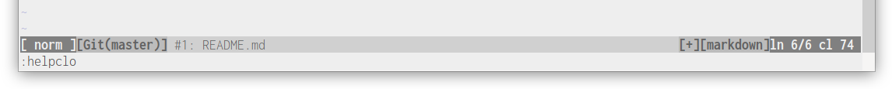
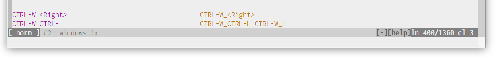
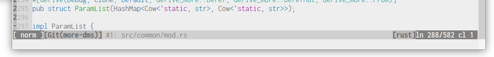
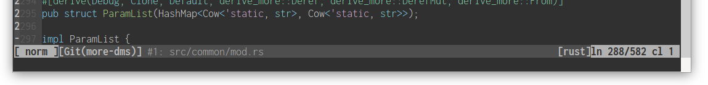
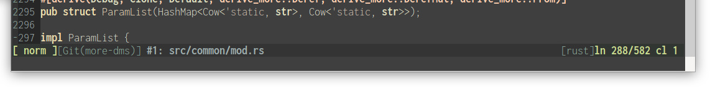
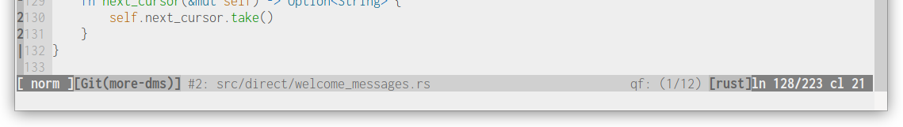
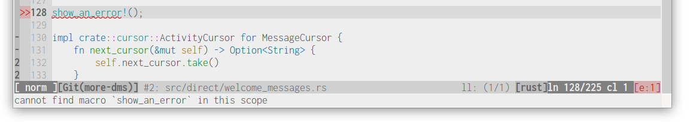
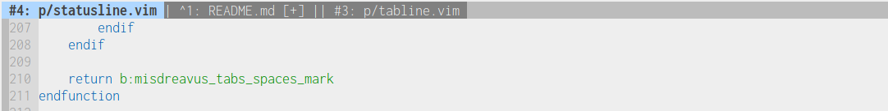
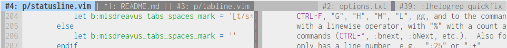
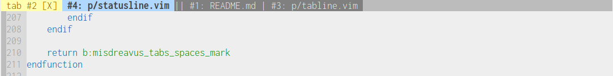

# ghostline

*a vim statusline/tabline created and preferred by a certain ghost-type pokémon*

\
\
\
\
\

`ghostline` started as an experiment to write my own status-bar and tab-bar and understand the
things that [vim-airline] was doing under-the-hood to create its fancy UI. Over time it became one
of my testbeds for writing vim-script and displaying more information in a relatively compact form.

The statusline includes integration with [vim-fugitive][] (displaying the current branch/commit) and
[ALE][] (displaying the number of errors in the current buffer, if any.

[vim-fugitive]: https://github.com/tpope/vim-fugitive
[ALE]: https://github.com/dense-analysis/ale

If there is an active quickfix or location list, the count and current item number will be
displayed:

\

## tabline

`ghostline` also includes a custom tabline, displaying active buffers, including their `modified`
status:

Certain kinds of buffers (help windows, quickfix/location list windows, preview windows) will only
be shown in the tabline if they're currently visible. If one of these windows isn't the
currently-active one, they will be displayed on the right side of the tabline:

If there are active tabs, the buffer list will continue to be displayed, but an additional indicator
will be added with the number of the current tab:

The current buffer will always be shown in the top left. Right next to it is the buffer for the
"alternate" file (`:help alternate-file`), which can be accessed using `Ctrl-^` (`:help CTRL-^`).
The alternate file's buffer is also indicated using a `^` by the buffer number instead of `#`. The
remaining buffers are then listed after that.

If `misdreavus-mru` is enabled, the MRU list for the current window is used for the "lead tabs"
instead, meaning that the buffer before the "lead tabs" marker (the `||` in the bar or the last
buffer if no `||` is listed) will be the one switched to with the `<Plug>RotateMru` action.
